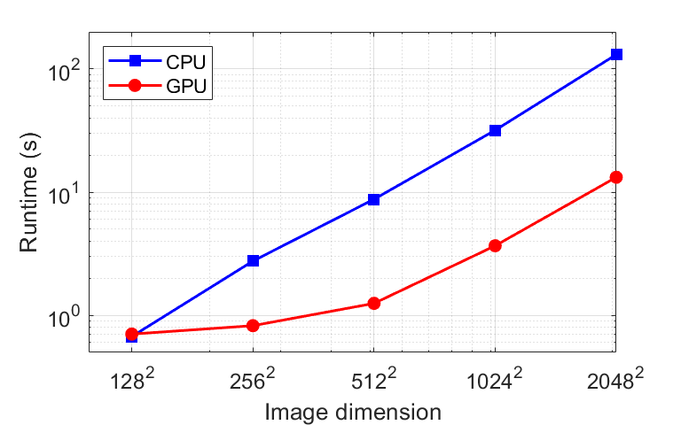

# [Compressive phase retrieval via constrained complex total variation regularization (CCTV)](https://www.light-am.com/article/doi/10.37188/lam.2023.006)

Authors: **[Yunhui Gao](https://github.com/Yunhui-Gao)** (gyh21@mails.tsinghua.edu.cn) and **[Liangcai Cao](https://scholar.google.com/citations?user=FYYb_-wAAAAJ&hl=en)** (clc@tsinghua.edu.cn)

*[HoloLab](http://www.holoddd.com/), Tsinghua University*
_______

<p align="left">

</p>

<p align="left"> <strong>Figure 1</strong>. Overview of the proposed method. (a) Schematic of the in-line holographic imaging system. (b) Captured raw hologram of a transparent Fresnel zone plate. Scale bar 1 mm. (c) Retrieved phase distribution. (d) Rendered surface height profile.</p>

## Requirements
Matlab 2019a or newer. Older visions may be sufficient but have not been tested.

## Quick Start
- **Phase retrieval using simulated data.** Run [`demo_sim.m`](https://github.com/THUHoloLab/CCTV-phase-retrieval/blob/master/main/demo_sim.m) with default parameters.
- **Phase retrieval using experimental data.** First follow the instruction [here](https://github.com/THUHoloLab/CCTV-phase-retrieval/tree/master/data/experiment) to download the data. Then run [`demo_exp.m`](https://github.com/THUHoloLab/CCTV-phase-retrieval/blob/master/main/demo_exp.m) with default parameters.
- **Try on your own experiment data.** Prepare a hologram and an optional reference image, run [`preprocessing.m`](https://github.com/THUHoloLab/CCTV-phase-retrieval/blob/master/main/preprocessing.m) and set the experiment parameters (e.g. pixel size, wavelength, and sample-to-sensor distance). Then run [`demo_exp.m`](https://github.com/THUHoloLab/CCTV-phase-retrieval/blob/master/main/demo_exp.m) and see how it works.


## Accelerated Implementations
The basic demo codes provide intuitive and proof-of-concept implementations for beginners, but are far from efficient. To facilitate faster reconstruction, we provide an optimized version based on CPU or GPU, which can be found at [`demo_sim_fast.m`](https://github.com/THUHoloLab/CCTV-phase-retrieval/blob/master/main/demo_sim_fast.m) and [`demo_exp_fast.m`](https://github.com/THUHoloLab/CCTV-phase-retrieval/blob/master/main/demo_exp_fast.m) for simulated and experimental data, respectively. To enable GPU usage, simply set `gpu = true;` in the code.

Table 1 and Figure 2 show the runtime (200 iterations) for different image dimensions. The results are obtained using a laptop computer with Intel&reg; Core&trade; i7-12700H (2.30 GHz) CPU and Nvidia GeForce RTX&trade; 3060 GPU.


|  Image dimension    | CPU runtime (s) | GPU runtime (s) |
|  :----:             | :----:          | :----:          |
|  128 $\times$ 128   | 0.673           | 0.704           |
|  256 $\times$ 256   | 2.76            | 0.824           |
|  512 $\times$ 512   | 8.76            | 1.25            |
|  1024 $\times$ 1024 | 31.8            | 3.67            |
|  2048 $\times$ 2048 | 130.8           | 13.2            |

<p align="left"> <strong>Table 1</strong>. Runtimes (for 200 iterations) using GPU and CPU for different image dimensions.</p>


<p align="left">

</p>

<p align="left"> <strong>Figure 2</strong>. Runtimes (for 200 iterations) using GPU and CPU for different image dimensions.</p>

## Theories and References
For algorithm derivation and implementation details, please refer to our paper:

- [Yunhui Gao and Liangcai Cao, "Iterative projection meets sparsity regularization: towards practical single-shot quantitative phase imaging with in-line holography," Light: Advanced Manufacturing 4, 6 (2023).](https://www.light-am.com/article/doi/10.37188/lam.2023.006)


## Citation

```BibTex
@article{gao2023iterative,
  title={Iterative projection meets sparsity regularization: towards practical single-shot quantitative phase imaging with in-line holography},
  author={Gao, Yunhui and Cao, Liangcai},
  journal={Light: Advanced Manufacturing},
  volume={4},
  number={1},
  pages={37--53},
  year={2023},
  publisher={Light: Advanced Manufacturing}
}
```